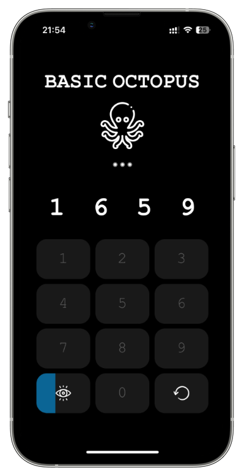

# Smart Octopus

## About the Game 🎯

Smart Octopus is a [mini-game](https://mgiesen.github.io/Smart-Octopus/) in the browser, designed to enhance cognitive skills such as working memory and mental arithmetic. Depending on the chosen difficulty level, the user is presented with a sequence of numbers for a limited time. The task is to not only remember the numbers but also to increment them mentally by one and then input the modified sequence.

## How to Play? 🎮

1.  **Open Game**: Open the game in your browser using this [link](https://mgiesen.github.io/SmartOctopus/).
2.  **Start Game**: Click on the "Power Button" to start the game.
3.  **Select Difficulty**: By clicking on the octopus, you can set the level of difficulty. The difficulty levels are as follows:

- Slow Octopus: Displays 3 numbers, display duration 2000 ms.
- Lazy Octopus: Displays 4 numbers, display duration 2000 ms.
- Basic Octopus: Displays 4 numbers, display duration 1500 ms.
- Active Octopus: Displays 5 numbers, display duration 1000 ms.
- Clever Octopus: Displays 6 numbers, display duration 1500 ms.
- Smart Octopus: Displays 7 numbers, display duration 1200 ms.

4.  **Watch the Numbers**: A sequence of numbers will be displayed for a limited time.
5.  **Add the Numbers**: After the numbers disappear, increment each number by one and input the new sequence.
6.  **Input**: Use the number fields at the bottom of the screen. Correct entries are marked green, incorrect ones red.
7.  **End of Game**: The round ends once all numbers have been input. A new round automatically starts.

**Note**: When a 9 is displayed, input a 0.

## Motivation 💡

Smart Octopus is based on the principle of the "dual task". It challenges not only working memory through remembering numbers but also mental arithmetic skills through addition.

The game intensively exercises working memory by prompting the player to hold multiple numbers in their head while simultaneously performing mathematical operations. Research in cognitive psychology suggests that such exercises can strengthen working memory.

Inspiration for the game came from a [Veritasium YouTube Video](https://www.youtube.com/watch?v=UBVV8pch1dM) published on March 2nd, 2017. The theoretical foundation comes from the book "Schnelles Denken, langsames Denken" by Daniel Kahneman.

## About the Source Code 🛠️

Originally designed as a quick evening project, the code was not intended for a GitHub release. Refactoring and improved documentation are necessary. Future extensions are conceivable. Contributions to further development are warmly welcomed.
